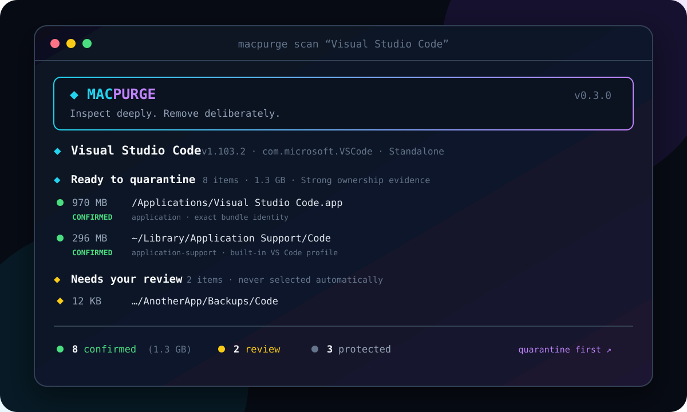
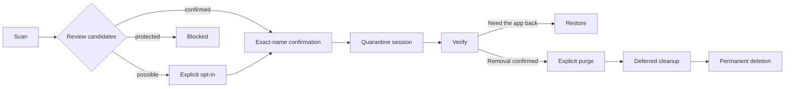

<div align="center">

# ◆ macpurge

### A safety-first, reversible macOS application uninstaller

Find the files an app leaves behind, review the evidence, and move verified items into quarantine before anything is permanently removed.

[](https://www.apple.com/macos/)
[](https://bun.sh/)
[](#privacy)
[](#safety-model)



</div>

> [!CAUTION]
> macpurge can move and permanently delete application files. This is an early, machine-specific release for Apple Silicon and macOS 27. Always inspect `scan` or `uninstall --dry-run` before approving a real operation.

## Why macpurge?

Dragging an app to Trash usually removes only its `.app` bundle. Caches, preferences, launch agents, CLI links, package receipts, helper tools, and application data can remain spread across macOS.

macpurge combines deep discovery with a deliberately conservative mutation model:

- **Evidence before action** — every candidate records why it matched.
- **Three risk classes** — confirmed, review, and protected paths are visually distinct.
- **Quarantine first** — normal uninstall operations move files instead of deleting them.
- **Explicit permanence** — irreversible cleanup happens only through a separate `purge` command.
- **No surprise selection** — possible matches are never selected automatically.
- **Local by design** — no network requests, telemetry, analytics, or auto-updater.
- **Automation-friendly** — human-readable terminal output and stable JSON envelopes.

## Highlights

| Capability | What it does |
| --- | --- |
| Application discovery | Reads `/Applications` and `~/Applications`, including nested and symlinked bundles |
| Identity extraction | Collects display name, bundle ID, Team ID, version, path, and install source |
| Layered scanning | Checks standard Library paths, Spotlight, bounded filesystem matches, CLI links, processes, helpers, and registrations |
| Installer awareness | Detects standalone apps, Homebrew casks, App Store receipts, and PKG receipts |
| Safety classification | Separates strong ownership evidence from ambiguous or protected paths |
| Reversible sessions | Stores versioned manifests and moves same-volume files into per-app quarantine sessions |
| Controlled cleanup | Defers Keychain, TCC, login item, Homebrew, and package-receipt actions until permanent purge |
| Restore protection | Never overwrites an existing destination |
| Extensible rules | Loads declarative JSON profiles without allowing arbitrary command execution |

## Requirements

- Apple Silicon Mac
- macOS 27
- [Bun 1.4](https://bun.sh/)
- Standard macOS command-line utilities used by `macpurge doctor`

The current release is intentionally built and tested for one local Apple Silicon configuration. Other macOS versions and Intel Macs are not yet supported targets.

## Install from source

```bash
git clone https://github.com/mustafaerpek/macpurge.git
cd macpurge
bun install --frozen-lockfile
bun run check
bun test
bun run build
install -m 755 dist/macpurge ~/.bun/bin/macpurge
```

Make sure `~/.bun/bin` is available in your `PATH`, then confirm the installation:

```bash
macpurge --version
macpurge doctor
```

The build script creates a standalone `bun-darwin-arm64` executable and reapplies a local ad-hoc code signature for current macOS runtime validation.

## Quick start

Open the searchable interactive application picker:

```bash
macpurge
```

Or inspect an application directly:

```bash
macpurge scan "Visual Studio Code"
macpurge uninstall "Visual Studio Code" --dry-run
macpurge uninstall "Visual Studio Code"
```

After quarantine, macpurge prints both recovery choices:

```bash
macpurge restore <session-id>  # Put every available item back
macpurge purge <session-id>    # Permanently remove the quarantine
```

## Command reference

| Command | Purpose | Mutates the system? |
| --- | --- | :---: |
| `macpurge` | Search for one installed application and open the guided flow | After confirmation |
| `macpurge list [--json]` | List discovered applications and install sources | No |
| `macpurge scan <selector> [--json] [--no-deep]` | Find and classify related files | No |
| `macpurge uninstall <selector> [options]` | Move selected candidates into quarantine | Yes |
| `macpurge history [--json]` | Display recorded sessions and states | No |
| `macpurge restore <session-id> [options]` | Restore quarantined files to their original paths | Yes |
| `macpurge purge <session-id> [options]` | Run deferred cleanup and permanently delete one quarantine | Yes, irreversible |
| `macpurge verify <selector\|session-id> [--json]` | Rescan for files, processes, helpers, and registrations | No |
| `macpurge doctor [--json]` | Check architecture, Bun, tools, paths, and authorization readiness | No |
| `macpurge rules validate\|list\|explain` | Inspect the active declarative rule set | No |

### Common options

| Option | Meaning |
| --- | --- |
| `--json` | Emit the stable machine-readable envelope without ANSI formatting |
| `--no-deep` | Skip the bounded filesystem-name scan |
| `--dry-run` | Build and display the uninstall plan without moving anything |
| `--include <candidate-id>` | Explicitly include one review candidate; may be repeated |
| `--confirm <exact-value>` | Supply the exact confirmation in non-interactive use |
| `--help`, `-h` | Show the command guide |
| `--version`, `-v` | Print the installed version |

## Safety model

macpurge displays candidates in three classes:

| Class | Marker | Default | Meaning |
| --- | :---: | :---: | --- |
| `confirmed` | 🟢 | Selected | Exact app bundle, exact standard path, verified app symlink, trusted receipt payload, or validated profile match |
| `possible` | 🟡 | Not selected | Name-only match, data nested under another application, or potentially shared payload |
| `protected` | ⚪ | Blocked | Project settings, personal documents, broad roots, system developer tools, Apple apps, or paths that cannot be proven safe |

Protected candidates cannot be forced through `--include`. Possible candidates require an explicit interactive choice or their exact candidate ID.

### Protected boundaries

The path safety layer rejects, among other cases:

- `/`, the user home directory, and Library roots
- `/Applications` and other broad application roots
- parent traversal such as `..`
- unresolved environment variables and wildcard paths
- project `.vscode` directories
- personal `Documents`, `Desktop`, and `Downloads` content found by broad matching
- `/Library/Developer` and Apple system applications
- symlinks that do not resolve into the selected application
- quarantine paths belonging to another session

Every selected path, real path, ownership, symlink target, and filesystem boundary is checked again immediately before mutation.

## Quarantine lifecycle



Quarantine data lives at:

```text
~/Library/Application Support/macpurge/quarantine/<session-id>
```

Session manifests remain available under:

```text
~/Library/Application Support/macpurge/sessions
```

Each manifest records the application identity, evidence, size, ownership, permissions, original path, quarantine path, item result, deferred actions, warnings, errors, and current transaction state.

Supported states are:

```text
planned → quarantining → quarantined → restored
                         └────────────→ purging → purged
              failures may produce partial or failed
```

## What gets scanned?

macpurge combines multiple bounded sources instead of trusting a single filename search:

1. Application bundle metadata from `Info.plist` and code signing.
2. Known user and system Library locations.
3. Spotlight metadata through `mdfind`.
4. A bundle-ID/name scan limited to approved local roots and depth.
5. CLI symlinks and their resolved targets.
6. Running processes and normal application quit state.
7. Login items, background registrations, and `launchctl` references.
8. LaunchAgents, LaunchDaemons, and PrivilegedHelperTools.
9. Homebrew cask metadata, App Store receipts, and PKG receipts.
10. Current-user macOS temporary directories.
11. Exact derived Keychain service names—never a general Keychain dump.

Other user accounts, external volumes, cloud data, subscriptions, OAuth grants, and remote sync state are outside the v1 scope.

## Package-manager behavior

### Homebrew casks

The cask registration remains untouched while files are quarantined. During purge, macpurge invokes the supported Homebrew uninstall flow. If Homebrew cleanup fails, the quarantine payload is retained.

### App Store applications

The local app receipt travels with the `.app` bundle. Purchase history and the App Store account are never modified.

### PKG installations

Only application-specific, strongly attributable payloads can be confirmed automatically. Potentially shared system paths remain review candidates. `pkgutil --forget` runs only after the purge workflow reaches its deferred-cleanup stage.

## Running applications

Before quarantine, macpurge requests a normal quit using the bundle ID and waits five seconds. If processes remain, it can request `SIGTERM`; `SIGKILL` requires a separate confirmation. Non-interactive execution never approves force termination automatically.

## Non-interactive and JSON use

Mutation commands require exact confirmation when stdin is not a TTY:

```bash
macpurge uninstall "/Applications/Example.app" \
  --confirm "Example"

macpurge purge 4eb2f695-9d7d-4dcc-9b65-e51e2a39fcab \
  --confirm 4eb2f695-9d7d-4dcc-9b65-e51e2a39fcab
```

JSON responses contain `schemaVersion`, `status`, `warnings`, and `errors`, plus command-specific data such as `app`, `candidates`, or `sessionId`:

```bash
macpurge scan "Example" --json | jq '.candidates[] | select(.risk == "confirmed")'
```

Exit codes are stable:

| Code | Meaning |
| :---: | --- |
| `0` | Success |
| `1` | Runtime failure |
| `2` | Invalid usage or rule |
| `3` | User cancelled |
| `4` | Partial operation; review or rollback required |
| `5` | Verification found residue |

## Custom rules

Place user profiles under `~/.config/macpurge/rules/*.json`:

```json
{
  "schemaVersion": 1,
  "id": "example-app",
  "bundleIds": ["com.example.application"],
  "platform": "darwin",
  "candidates": [
    {
      "pathTemplate": "{home}/Library/Application Support/Example",
      "kind": "application-support",
      "risk": "confirmed",
      "reason": "Application-owned user data"
    }
  ]
}
```

Allowed template tokens:

- `{home}`
- `{bundleId}`
- `{appName}`
- `{temp}`

Rules may describe only paths, classifications, reasons, and supported platform conditions. They cannot contain or execute arbitrary commands. Wildcards, traversal, unknown tokens, and protected-root matches are rejected.

Validate and explain rules before relying on them:

```bash
macpurge rules validate
macpurge rules list
macpurge rules explain "Visual Studio Code"
```

Built-in profiles currently cover Visual Studio Code and Floodtide. General bundle-based scanning works without an application-specific profile.

## Architecture

```text
src/
├── apps.ts            application discovery and identity
├── cli.ts             command routing and interactive flows
├── command.ts         shell-free Bun.spawn command runner
├── manifest-store.ts  atomic session persistence
├── processes.ts       quit and process handling
├── quarantine.ts      quarantine, restore, and purge transactions
├── rules.ts           built-in and user rule validation
├── safety.ts          path and mutation boundaries
├── scanner.ts         layered discovery and classification
├── system-paths.ts    approved local macOS roots
├── types.ts           public domain types and JSON contracts
└── ui.ts              color, layout, status, and terminal presentation
```

All external commands use argument arrays through `Bun.spawn({ cmd: [...] })`. User input is never interpolated into a shell command.

## Development

```bash
bun install
bun run check
bun test
bun run build
```

The suite uses temporary fake macOS roots and command-runner doubles. It does not uninstall real applications. Current coverage includes:

- ambiguous selectors and multiple same-name applications
- VS Code-style data, extensions, CLI links, and updater files
- protection of project `.vscode` directories
- ambiguous copies under another application's data
- Homebrew, App Store, and PKG scenarios
- symlink escape, traversal, roots, malformed rules, and permissions
- graceful quit, forced termination, and denied escalation
- partial movement and manifest continuity
- restore collisions and overwrite prevention
- deferred irreversible actions
- JSON envelopes and exit codes
- standalone binary smoke checks

## Privacy

macpurge runs locally. It does not include network calls, telemetry, crash reporting, analytics, advertising, remote configuration, or an update service. Scans are limited to the current user and shared local system locations described above.

Keychain discovery is restricted to exact service names derived from the selected application. macpurge never enumerates or exports the user's complete Keychain.

## Troubleshooting

### The interface has no color

macpurge respects terminal capabilities and the [`NO_COLOR`](https://no-color.org/) convention. Check whether `NO_COLOR` is set in your shell environment.

### `doctor` reports administrator access as “On demand”

This is expected. macpurge does not install a privileged helper or cache its own credentials. macOS requests authorization only if a reviewed system-owned target needs it.

### Restore reports a destination collision

macpurge will not overwrite the existing path. Move or rename the conflicting file after reviewing it, then retry the restore session.

### A partial session cannot be purged

Review the manifest and restore the successfully moved files. macpurge blocks permanent purge while the transaction contains unresolved unmoved items.

## Inspiration

The terminal presentation was inspired by the clarity and energy of [Mole](https://github.com/tw93/Mole). macpurge is an independent TypeScript implementation focused specifically on evidence-based application removal, reversible quarantine, and explicit permanent cleanup.

## Disclaimer

Use this software at your own risk. Review every candidate and keep current backups. A public repository makes the source visible; it does not replace independent security review for a tool that changes local files.

---

<div align="center">

Built by [Mustafa Erpek](https://github.com/mustafaerpek) for careful Mac cleanup.

</div>
